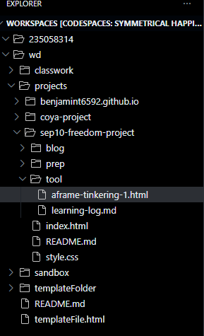

# Entry 4
##### 3/15/26

## Content

### Tinkering with Aframes
In SEP, we had to choose a tool to tinker with that we would use for our Freedom Projec that we have been working on the whole year. In class, we toured multiple tools that we could tinker with such as Jekyll but one that really caught me eye was Aframes. For Part B of my Freedom Project, we had to theororize inventions that could exist in the future. Since my topic was Nuclear Engineering/Applied Physics, I decided to create a phone that was powered by an Artificial Sun Satellite that would perpetually charge the phone. Since Aframes was a tool that could be used to 3d model objects using HTML, I knew it was perfect for modeling my Artifical Sun Powered Phone that could exist in the future. To begin tinkering with Aframes, I created a new HTML file in the tool part of my SEP10 Freedom Project directory in my projects on my IDE, as seen  After, I proceeded to go the Aframes website and copy and paste the starter code into the HTML file to begin tinkering. After doing so, I typed in the command `http-server` to view the website, as seen  There, I was able to move around and saw multipe shapes on a 3d green plane. I tinkered with the shapes and plane by altering the height and width of both, in an effort to test the capabilities of Aframes.

## Skills
Some skills I have developed from working on this blog and tinkering with Aframes are Problem Solving, Technical Skills, and Creativity.

### Problem Solving
By tinkering with Aframes and adjusting the various shapes, the 3d plane, and attributes of Aframes in my HTML file, I practiced experimenting even when things didn’t work the way I expected. This helped me develop problem-solving skills as I tested the different changes I made by editing the code and finding out how Aframes behaves.

### Technical Skills
As I created and edited the HTML file in my IDE while using commands like `http-server`, I improved my technical skills with Git tools and using my IDE. It helped me become more comfortable working with my IDE and different technologies and understand how my code turns into a working system.

### Creativity
While thinkign about how I could design my Part B concept of an Artificial Sun Powered Phone in Aframes, I practiced creative thinking about future technologies. It helped me develop the ability ttheororize how I could turn imaginitive ideas into fully modeled scientific innovations.

## Next Steps
I am looking forward to progressing my Freedom Project and using Aframes as a way to creatively model my Part B idea.

[Previous](entry03.md) | [Next](entry05.md)

[Home](../README.md)
